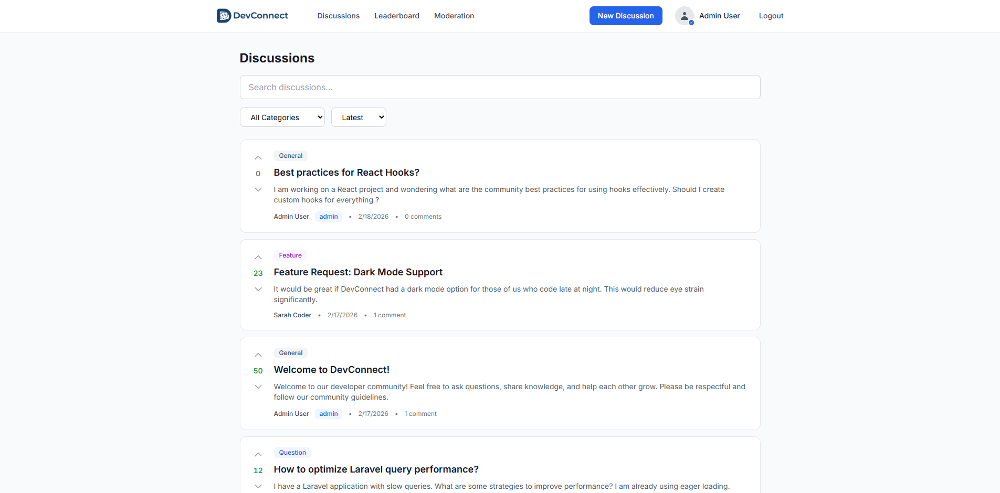
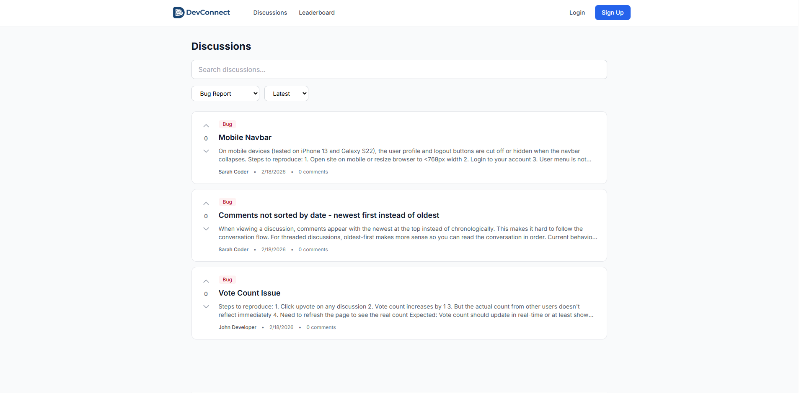
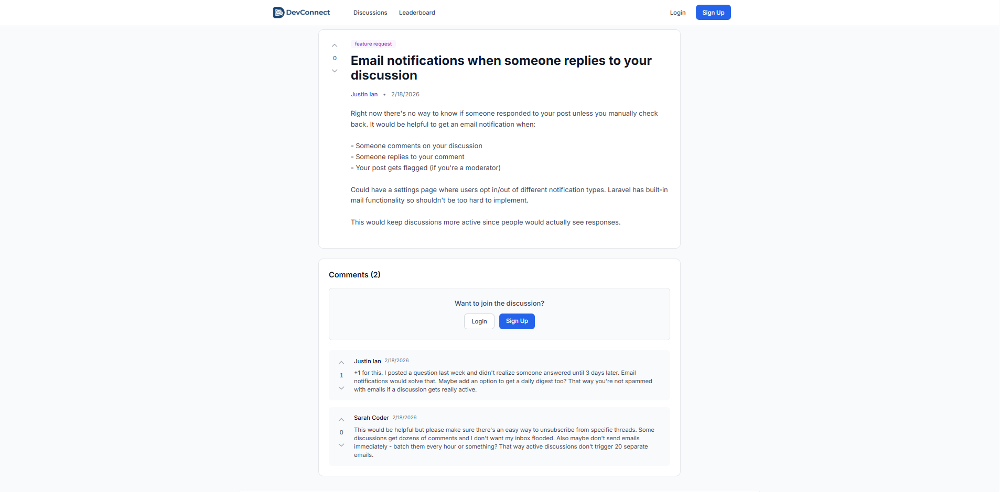
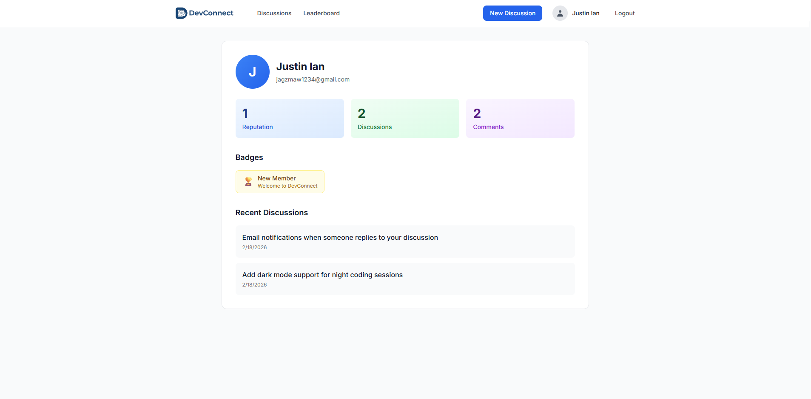
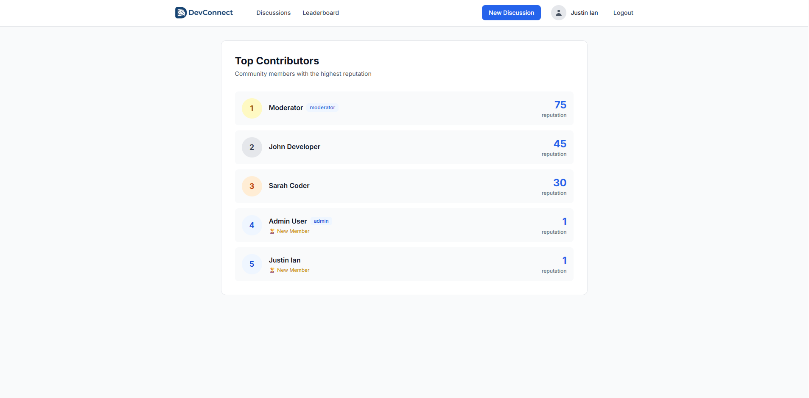
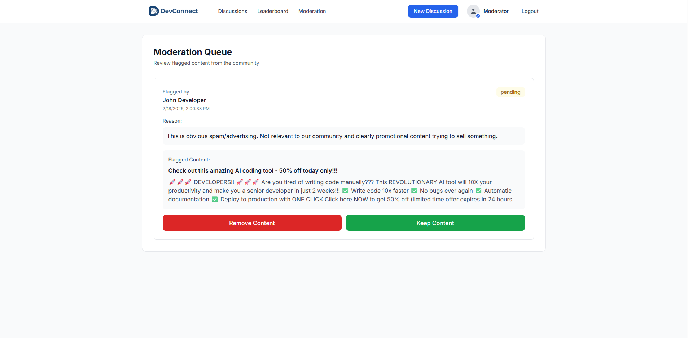

# DevConnect

A full-stack community discussion platform I built using React and Laravel. Users can create discussions, comment, vote, and earn reputation points. Includes a moderation system for handling flagged content.



## What It Does

This is basically a discussion forum where developers can ask questions, share ideas, and help each other out. Think Reddit or Stack Overflow, but simpler and focused on community building.

**Key features:**
- Post discussions in different categories (questions, feature requests, bug reports, etc.)
- Comment on discussions
- Upvote/downvote system with reputation tracking
- Badge system that rewards active contributors
- Moderation tools for admins to review flagged content
- User profiles showing activity and earned badges

## Screenshots

### Discussions Feed

*Browse and filter discussions by category*

### Discussion Detail

*Read discussions, vote, and leave comments*

### User Profile

*User stats, badges, and recent activity*

### Leaderboard

*Top contributors ranked by reputation*

### Moderation Dashboard

*Review and manage flagged content (admin/moderator only)*

## Tech Stack

**Backend:**
- Laravel 11 (PHP framework)
- MySQL database
- Laravel Sanctum for authentication
- RESTful API design

**Frontend:**
- React 18 with Vite
- Tailwind CSS for styling
- Zustand for state management
- React Router for navigation
- Axios for API calls

## Running It Locally

You'll need PHP, Composer, Node.js, and MySQL installed.

### Backend Setup

```bash
cd backend
composer install
cp .env.example .env
```

Edit `.env` and set your database credentials, then:

```bash
php artisan key:generate
php artisan migrate
php artisan db:seed --class=DemoDataSeeder
php artisan serve
```

The API will run on `http://localhost:8000`

### Frontend Setup

Open a new terminal:

```bash
cd frontend
npm install
npm run dev
```

The app will run on `http://localhost:5173`

## Demo Accounts

The seeder creates these accounts you can use:

- **Admin:** admin@devconnect.com / password
- **Moderator:** mod@devconnect.com / password  
- **Regular users:** john@example.com / password

## How It's Organized

The reputation system works by tracking upvotes and downvotes on discussions and comments. Users earn badges automatically as they hit certain reputation milestones (10, 50, 100 points).

Moderators and admins can delete or edit any content. Regular users can only manage their own posts. Anyone can flag content for review, which goes into a moderation queue.

The backend uses polymorphic relationships for votes and flags, so the same system handles both discussions and comments without duplicate code.

## API Highlights

All routes are in `backend/routes/api.php`. Main endpoints:

- `POST /api/register` - Create account
- `POST /api/login` - Get auth token
- `GET /api/discussions` - List discussions (supports filtering and search)
- `POST /api/discussions` - Create new discussion (requires auth)
- `POST /api/vote` - Upvote or downvote content
- `GET /api/leaderboard` - Top 10 users by reputation

Full list is in the API routes file.

## Design Decisions

I kept the UI minimal and functional instead of over-designed. Used standard user icons instead of generated avatars, simple text buttons instead of icon-only buttons, and avoided unnecessary animations.

The frontend is intentionally kept simple - no global state library bloat, just Zustand for auth and discussion data. Routes are protected based on authentication status and user role.

On the backend, I used Laravel's built-in features (Eloquent, Gates, migrations) rather than reinventing the wheel. The reputation calculation happens automatically when votes are cast.

## What I Learned

This was good practice for:
- Building a complete REST API from scratch
- Implementing role-based access control
- Designing a polymorphic voting system
- Managing state in React without Redux
- Creating a moderation workflow
- Deploying full-stack apps

## Deployment

The backend can be deployed to Railway or any Laravel-compatible host. Frontend deploys easily to Netlify or Vercel.

You'll need to:
1. Set up a production database
2. Configure environment variables
3. Update CORS settings for your frontend domain
4. Set the API URL in the frontend env

## Known Issues

- Votes trigger a page reload to update counts (could use websockets for real-time updates)
- No pagination on comments yet
- Search only looks at titles and bodies, not comments
- No email verification on registration

These are on my list to improve if I keep working on this.

## License

MIT - feel free to use this for learning or as a starting point for your own projects.

---

Built this to practice full-stack development and showcase Laravel + React integration. If you have questions or suggestions, feel free to open an issue.

👨‍💻 About
Built by: Justin Ian